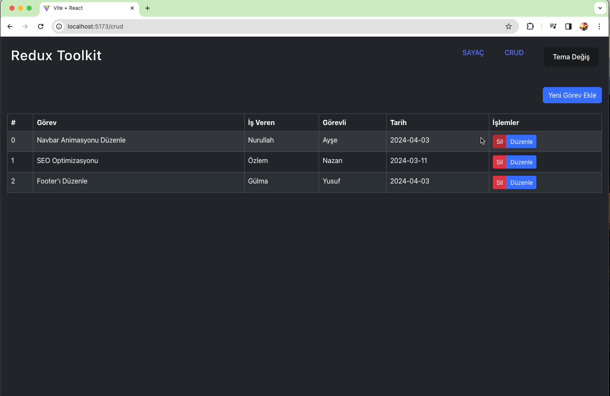

<h1> Redux Toolkit Kullanarak React Uygulaması</h1>

Bu proje, Redux Toolkit'i kullanarak basit bir React uygulaması geliştirmek için oluşturulmuştur. Uygulama, bir sayaç örneği ve basit bir CRUD (Create, Read, Update, Delete) işlevselliği içermektedir.

<h2>Özellikler</h2>

Sayaç örneği: Arttırma, azaltma ve özel bir sayıya ayarlama işlevselliği
CRUD işlevselliği: Görev ekleme, silme ve düzenleme
Tema Değiştirme: Kullanıcı arayüzü için açık veya koyu tema seçeneği
Başlangıç
Projeyi yerel makinenizde çalıştırmak için aşağıdaki adımları izleyin:

<h2>Kullanım</h2>

Sayaç sayfasına gidin ve arttırma veya azaltma düğmelerine tıklayarak sayaç değerini değiştirin.
Özel bir sayı girmek için sayaç değeri alanına bir sayı girin ve "Enter" tuşuna basın.
CRUD sayfasına gidin, yeni görev eklemek için "Yeni Görev Ekle" düğmesine tıklayın. Liste üzerindeki herhangi bir görevi silmek veya düzenlemek için ilgili düğmelere tıklayın.
Tema değiştirmek için sayfanın üst kısmındaki "Tema Değiş" düğmesine tıklayın.

<h2>Teknolojiler</h2>

Bu proje aşağıdaki teknolojiler kullanılarak geliştirilmiştir:

- React
- Redux Toolkit
- React Router
- React Bootstrap

<h2>Ekran Görüntüsü</h2>

